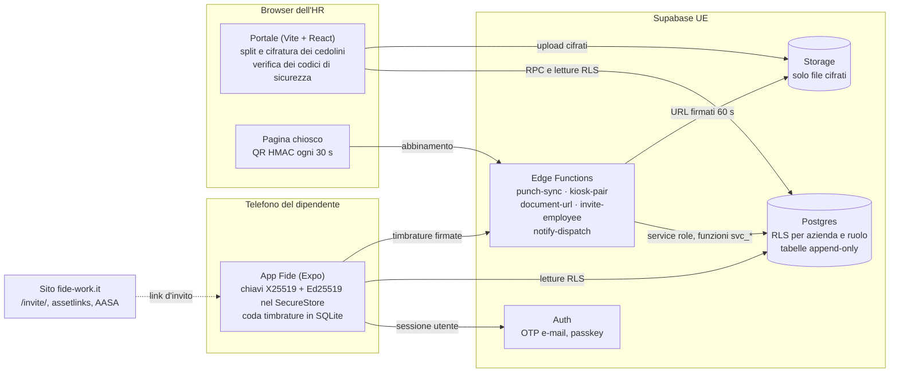

# Architettura di Fide (v2, pilota)

Tre client statici o mobili e un backend Supabase in regione UE. Il server non vede né posizioni né cedolini in
chiaro; le operazioni sensibili passano da funzioni del database o Edge Functions che verificano ogni richiesta.

## Componenti

| Parte | Dove | Note |
| --- | --- | --- |
| App | `app/apps/mobile` | Expo SDK 57, expo-router; 9 lingue; chiavi usate dopo lo sblocco del telefono |
| Portale e chiosco | `app/apps/web-portal` | Statico; CSP rigida (solo Supabase in `connect-src`) |
| Sito | `app/apps/site` | Statico, nessuna risorsa di terzi; serve i file di associazione per link e passkey |
| Database | `supabase/migrations` | Schema v2, RLS, RPC `SECURITY DEFINER` con `search_path = ''` ([supabase/README.md](../supabase/README.md)) |
| Funzioni | `supabase/functions` | Deno; codice di protocollo condiviso da `app/packages/shared` |

## Flussi

**Registrazione dell'azienda.** Il fondatore entra con un codice via e-mail (indirizzo in allowlist durante il
pilota) e chiama `register_company()`, che crea azienda, ruolo di owner e tipi di assenza italiani.

**Invito e attivazione del dipendente.** L'HR crea il dipendente (a mano o da CSV con `import_members()`, tutto o
niente) e lo invita: `invite-employee` genera il link `https://fide-work.it/invite/<token>` (nel database solo
l'hash, valido 7 giorni). Con l'app installata il link apre l'app; altrimenti la pagina del sito offre `fide://`.
Il dipendente entra con il codice via e-mail, `redeem_invitation()` verifica che l'e-mail coincida, l'app genera
le chiavi e le registra con `register_device_key()`.

**Timbratura.** L'app legge il QR del chiosco (o, se la sede lo consente, calcola «dentro/fuori» con una lettura
della posizione), chiede lo sblocco del telefono, firma il payload canonico `FIDE-PUNCH-v1` e lo mette in coda.
`punch-sync` ricostruisce il payload, verifica firma, chiave attiva, QR (finestra ±30 s, uso singolo) e orologio,
salva con `svc_record_punch()` e restituisce una ricevuta firmata dal server. Le anomalie diventano segnalazioni,
non rifiuti silenziosi.

**Cedolini.** Nel browser dell'HR: pdf.js estrae il testo, il parser assegna le pagine per codice fiscale, pdf-lib
crea un PDF per dipendente, ognuno viene cifrato (formato `fide-doc-v1`) per la chiave del telefono del destinatario
dopo la verifica del codice di sicurezza, poi `create_payroll_batch()`, upload e `publish_payroll_batch()`.
Sul telefono: `document-url` dà un URL firmato di 60 secondi e registra il download, l'app decifra dopo lo sblocco
e cancella il file temporaneo.

**Avvisi via e-mail.** Dei trigger mettono in una coda privata (`private.notification_outbox`) chi va avvisato e
di cosa: richiesta nuova (HR e responsabile), decisione, richiesta privacy (solo HR), risposta, documento nuovo. Ogni
minuto `pg_cron` chiama `notify-dispatch` (solo se c'è qualcosa in coda, con un token in Vault che cambia a ogni
deploy), che invia con Brevo nella lingua del destinatario. Nella coda niente indirizzi né contenuti; le e-mail non
dicono mai il tipo di assenza né cosa contiene un documento.

**Report mensile.** Il portale legge timbrature e assenze approvate del mese e produce i CSV per il consulente del
lavoro, in ora italiana.

## Dati e conservazione

Cosa si tratta e cosa no: allegato 1 dell'[accordo art. 28](legal/DPA_GDPR_Art28.md). Misure di sicurezza:
allegato 2. Stato effettivo dei controlli: [security/AUDIT-2026-10-07.md](security/AUDIT-2026-10-07.md).

## Fuori dal pilota

NFC, assistente IA, notifiche push (per ora solo e-mail), firma del mittente sui cedolini, trasferimento delle chiavi tra
telefoni, Spagna, SSO.
