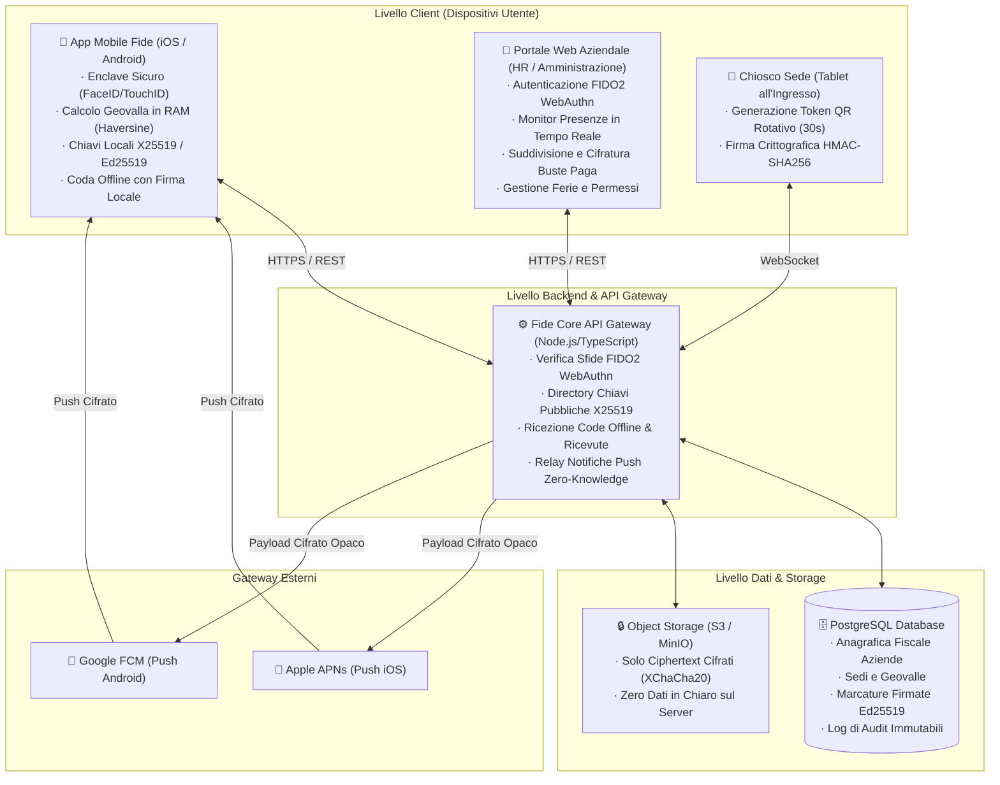
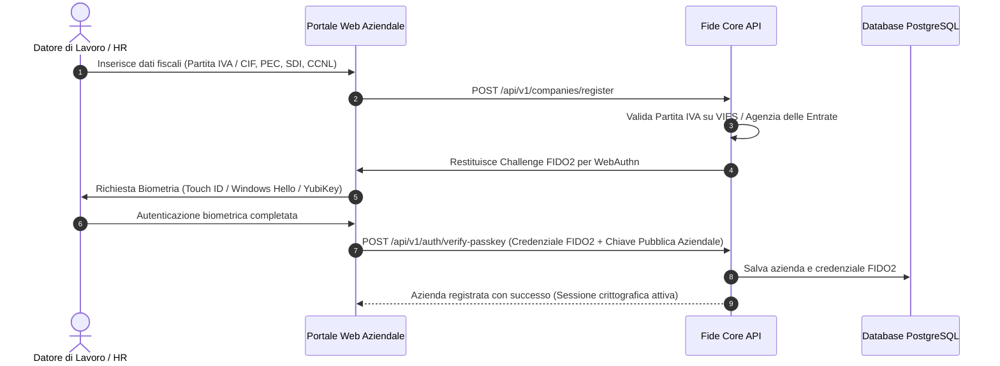
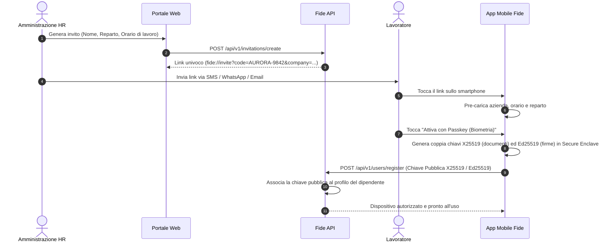
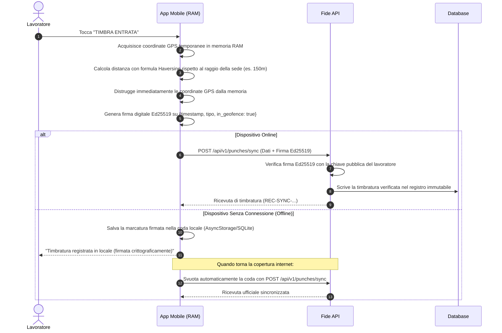
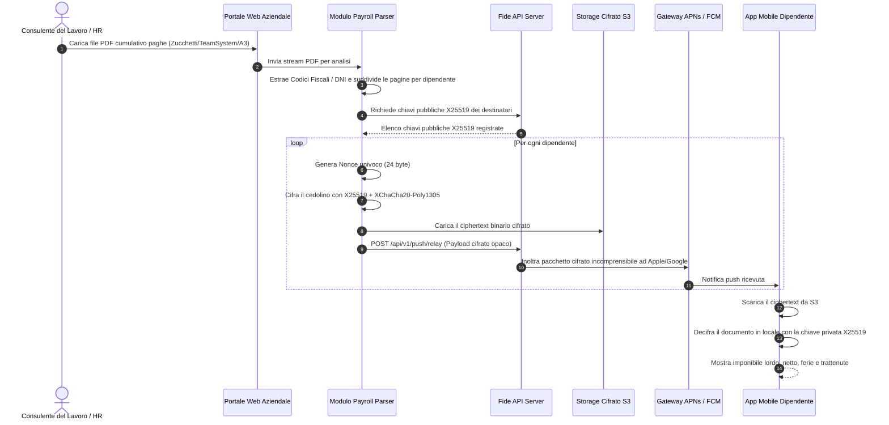

# Fide — Architettura del Sistema & Flussi Operativi di Produzione

> **Documento Tecnico di Architettura di Sistema**  
> Piattaforma di rilevazione presenze, gestione HR e distribuzione buste paga con **crittografia a conoscenza zero (Zero-Knowledge)**.

---

## 1. Mappa Globale dei Componenti

---

## 2. Flusso 1: Registrazione dell'Azienda e Amministratore (Zero Password)

Nessuna password viene creata o memorizzata per l'azienda.

---

## 3. Flusso 2: Invito del Lavoratore e Onboarding in < 1 Minuto

---

## 4. Flusso 3: Timbratura Presenze (Offline-First, Geovalla in RAM e QR Rotativo)

### A. Timbratura con Geovalla (Nessun dato GPS inviato)

### B. Timbratura con QR Rotativo (30 Secondi)
1. Il tablet all'ingresso espone un codice QR contenente:
   `FIDE:SITE:AURORA:<finestra_temporale_30s>:<firma_HMAC_SHA256>`
2. Il dipendente inquadra il QR con l'app Fide.
3. L'app verifica la validità del timestamp. Qualsiasi foto o screenshot catturato più di 30 secondi prima viene **automaticamente rifiutato**.

---

## 5. Flusso 4: Pipeline Buste Paga E2EE (Conoscenza Zero)

Come i cedolini paga vengono distribuiti senza che né Fide né Apple/Google possano leggerli:

---

## 6. Sicurezza e Separazione dei Dati

| Tipologia di Dato | Dove Risiede | Come è Protetto | Chi può leggerlo |
| :--- | :--- | :--- | :--- |
| **Dati Fiscali Aziendali** | Database PostgreSQL | Crittografia TLS in transito + AES-256 a riposo | Azienda e Fide (per adempimenti contrattuali) |
| **Coordinate GPS Lavoratore** | **Mai memorizzate** (Solo RAM volatile) | Distrutte istantaneamente dopo il calcolo Haversine | **Nessuno** (l'azienda riceve solo `in_geofence: true`) |
| **Buste Paga & Cedolini** | Object Storage S3 | **X25519 + XChaCha20-Poly1305** | **Solo il lavoratore** con la propria chiave privata sul telefono |
| **Dati Biometrici (FaceID/TouchID)** | **Secure Enclave / TEE** dello smartphone | Hardware isolation FIDO2 / WebAuthn | **Solo il processore biometrico locale** |
| **Firme delle Timbrature** | Database PostgreSQL | Algoritmo asimmetrico **Ed25519** | Verificabile dall'Ispettorato del Lavoro e dall'azienda |
